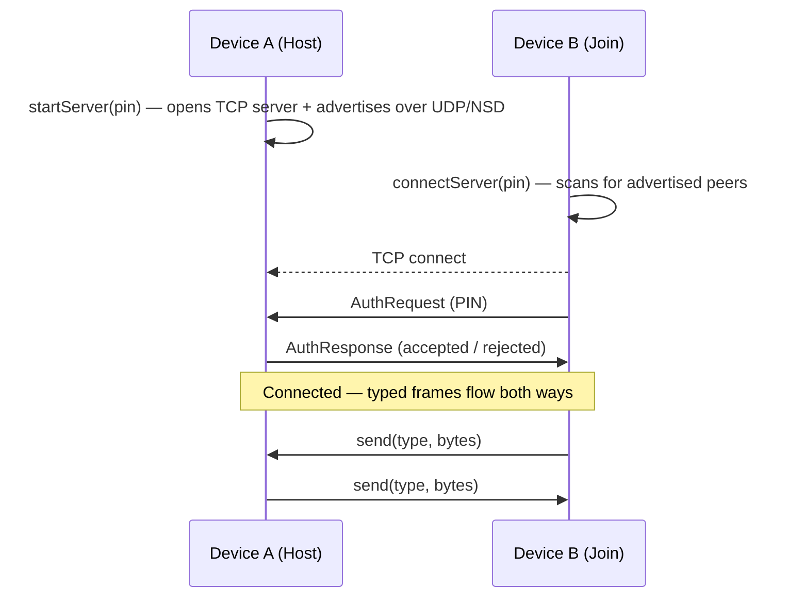

# LanLink

> Peer-to-peer chat over your local Wi‑Fi — no internet, no accounts, no servers. Pair two devices with a 6‑digit PIN and talk.

<p align="left">
  
  
  
  
  
  
</p>

**English** | [简体中文](README.zh-CN.md)

LanLink is a small, dependency-light **[Kotlin Multiplatform](https://kotlinlang.org/docs/multiplatform.html) library** for **local-network, device-to-device communication**. It handles peer discovery, connection, authentication, and a typed message pipe — so apps can build peer-to-peer features over Wi‑Fi without internet, accounts, or a backend. Platform-agnostic by design, it ships an Android target today.

A runnable `demo/` module — a PIN-paired LAN chat — exercises the library end to end.

---

## Highlights

- 🔢 **PIN pairing** — two devices that share the same 6‑digit code find each other and connect; no IP addresses to type.
- 📡 **Zero-config discovery** — UDP broadcast plus Android NSD (mDNS) locate peers on the same Wi‑Fi.
- 🔐 **Pluggable auth** — a shared-secret `InMemoryAuthProvider` with brute-force lockout out of the box, or bring your own `AuthProvider`.
- 🧩 **Typed message pipe** — every frame carries a `type` tag plus raw bytes, so you can multiplex chat, presence, files, or anything else over one connection.
- 🌊 **Coroutines & Flow** — connection state, inbound messages, and events are exposed as `StateFlow`/`SharedFlow`.
- 🧱 **Clean platform seam** — all transport sits behind a `LanNetworkFactory` interface; adding a new platform means writing one factory, not rewriting the protocol.
- ✅ **Tested** — 30+ unit tests across discovery, sockets, auth, and the connection service, runnable on the JVM without a device.

---

## How it works

Both devices agree on a 6‑digit PIN. One **hosts**, the other **joins**. Discovery, the auth handshake, and the message channel are all handled by `lanlink-core`.



If the PINs don't match, the host rejects the handshake and an `AuthFailed` event is emitted. After too many failed attempts the provider locks out the caller.

---

## Architecture

```
┌─────────────────────────────────────────────────────────┐
│  demo  (com.ymr.lanlink)  — sample app, not part of lib   │
│  MainActivity ─ LanViewModel ─ LanRepository ─ Service    │
└───────────────────────────┬─────────────────────────────┘
                            │ depends on
┌───────────────────────────▼─────────────────────────────┐
│  lanlink-core  (com.ymr.lanlink.core)                     │
│                                                           │
│  commonMain                                               │
│    service/   PinConnectionService — orchestration        │
│    net/       LanNetworkFactory, LanServer/Client (ifaces)│
│    data/      TcpSocket{Server,Client}, UdpDiscovery, auth │
│    domain/    ConnectionState, PeerInfo, AuthProvider …    │
│                                                           │
│  androidMain                                              │
│    AndroidLanNetworkFactory — wires Ktor sockets + NSD    │
└───────────────────────────────────────────────────────────┘
```

The key design decision is the **`LanNetworkFactory` seam**. `commonMain` orchestration depends only on interfaces (`LanServer`, `LanClient`, `DiscoveryAdvertiser`, `DiscoveryScanner`). The Android target supplies `AndroidLanNetworkFactory`; a future desktop/iOS target is added by writing a new factory, with the protocol and state machine reused unchanged.

### Tech stack

| Concern | Choice |
|---|---|
| Language | Kotlin 2.3.20, Kotlin Multiplatform |
| Transport | [Ktor](https://ktor.io/) `ktor-network` 3.5.0 (TCP sockets) |
| Wire format | `kotlinx-serialization-protobuf` 1.11.0, length-delimited frames |
| Async | `kotlinx-coroutines` 1.10.2 (`StateFlow` / `SharedFlow`) |
| Discovery | UDP broadcast + Android NSD (mDNS) |
| Build | Gradle 9.3.1, AGP 9.1.1, JVM 17, `minSdk 24` / `compileSdk 35` |

---

## Getting started

### Prerequisites

- JDK 17+
- Android SDK with API 35
- Two devices (or emulators) on the **same Wi‑Fi network**

### Try the demo

```bash
git clone git@github.com:yangwuan55/LanLink.git
cd LanLink

# Build and install the demo on a connected device
./gradlew :demo:installDebug
```

Run the demo on both devices, enter the **same 6‑digit PIN**, tap **Host** on one and **Join** on the other.

---

## Using `lanlink-core` as a library

From JitPack:

```groovy
// settings.gradle — repositories
maven { url 'https://jitpack.io' }

// app/build.gradle
implementation 'com.github.yangwuan55.LanLink:lanlink-core:0.1.2'
```

Or as a local module: `include(":lanlink-core")` + `implementation project(':lanlink-core')`.

Declare the permissions discovery and sockets need:

```xml
<uses-permission android:name="android.permission.INTERNET" />
<uses-permission android:name="android.permission.ACCESS_WIFI_STATE" />
<uses-permission android:name="android.permission.ACCESS_NETWORK_STATE" />
```

### Wire it up

```kotlin
// AndroidLanNetworkFactory supplies the Ktor-backed transport + discovery.
val service: PinConnectionService = PinConnectionServiceImpl(AndroidLanNetworkFactory())

// Host one side…
service.startServer(pin = "123456")

// …join from the other.
service.connectServer(pin = "123456")
```

### Observe state, messages, and events

```kotlin
service.connectionState.collect { state ->
    when (state) {
        is PinConnectionState.Discovering -> showSearching()
        is PinConnectionState.Connected   -> showConnected(state.peerName)
        is PinConnectionState.Error        -> showError(state.reason)
        else -> Unit
    }
}

service.messageFlow.collect { frame: TypedMessage ->
    if (frame.type == TYPE_CHAT) {
        val text = frame.payload.decodeToString()
        // render incoming message
    }
}

service.eventFlow.collect { event ->
    if (event is PinConnectionEvent.AuthFailed) showAuthError(event.reason)
}
```

### Send a message

```kotlin
const val TYPE_CHAT = 0

// `type` travels on the wire so the receiver knows how to parse the bytes —
// use different type values to multiplex multiple kinds of message.
service.send(type = TYPE_CHAT, data = "Hello!".encodeToByteArray())
```

### `PinConnectionService` at a glance

| Member | Purpose |
|---|---|
| `connectionState: StateFlow<PinConnectionState>` | Idle → Discovering → Connecting → Connected / Error |
| `messageFlow: SharedFlow<TypedMessage>` | Inbound frames (`type` tag + raw `payload` bytes) |
| `eventFlow: SharedFlow<PinConnectionEvent>` | Peer connected/disconnected, auth failed |
| `startServer(pin)` | Host: open the TCP server and advertise it |
| `connectServer(pin)` | Join: discover and connect to a host |
| `send(type, data)` | Send a typed frame to the peer |
| `disconnect()` | Tear down the session |

### Custom authentication

```kotlin
class TokenAuthProvider(private val token: ByteArray) : AuthProvider {
    override suspend fun authenticate(peerName: String, credentials: ByteArray?): AuthResult =
        if (credentials.contentEquals(token)) AuthResult.Success(peerName)
        else AuthResult.Failure("invalid token")

    override fun getCredentials(): ByteArray = token
}
```

Pass your provider through a custom `LanNetworkFactory` (see `AndroidLanNetworkFactory` for the wiring). The built-in `InMemoryAuthProvider` validates a 6‑digit PIN and locks out after repeated failures; `NoOpAuthProvider` accepts everyone (tests only).

---

## Wire protocol

Frames are **length-delimited protobuf** messages. The transport carries a `TypedMessage(type, payload)`: an integer `type` tag plus an opaque byte payload. The core never inspects the payload — your app owns the encoding for each type, so chat, presence, and file transfer can share a single connection.

---

## Project structure

```
LanLink/
├── lanlink-core/            # The Kotlin Multiplatform library
│   └── src/
│       ├── commonMain/      # protocol, service, interfaces, models
│       ├── commonTest/      # JVM-runnable unit tests
│       └── androidMain/     # Android factory, NSD, platform actuals
├── demo/                    # Demo Android app (MVVM) using the library
├── tests/                   # Robot Framework dual-device E2E suite
└── settings.gradle
```

---

## Testing

```bash
# Core unit tests (run on the JVM, no device required)
./gradlew :lanlink-core:testAndroidHostTest

# Demo unit tests
./gradlew :demo:testDebugUnitTest

# Android instrumented tests (device/emulator required)
./gradlew :demo:connectedDebugAndroidTest
```

A two-device end-to-end scenario (PIN pairing, send/receive, wrong-PIN rejection) lives in `tests/dual_device_test.robot` for Robot Framework + Appium setups.

---

## Roadmap

- [ ] Additional Kotlin Multiplatform targets (desktop/JVM, iOS) via new `LanNetworkFactory` implementations
- [ ] TLS / encrypted transport
- [ ] File and binary payload helpers on top of the typed pipe
- [x] Published to JitPack ([`0.1.2`](https://jitpack.io/#yangwuan55/LanLink))

---

## Security

> ⚠️ The default PIN handshake is **not encrypted**. Credentials and messages travel in clear text over the LAN.

LanLink is built for trusted local networks and demos. Before using it where traffic could be observed, add a TLS/encrypted transport and consider certificate-based authentication. The `AuthProvider` seam is the intended extension point for stronger schemes.

---

## Contributing

Issues and pull requests are welcome. Please:

1. Keep changes focused and covered by tests (`:lanlink-core:testAndroidHostTest` should stay green).
2. Match the existing module boundaries — protocol logic in `commonMain`, platform wiring in `androidMain`.
3. Run a build before opening a PR: `./gradlew :demo:assembleDebug :lanlink-core:testAndroidHostTest`.

---

## License

Released under the **Apache License 2.0**.
