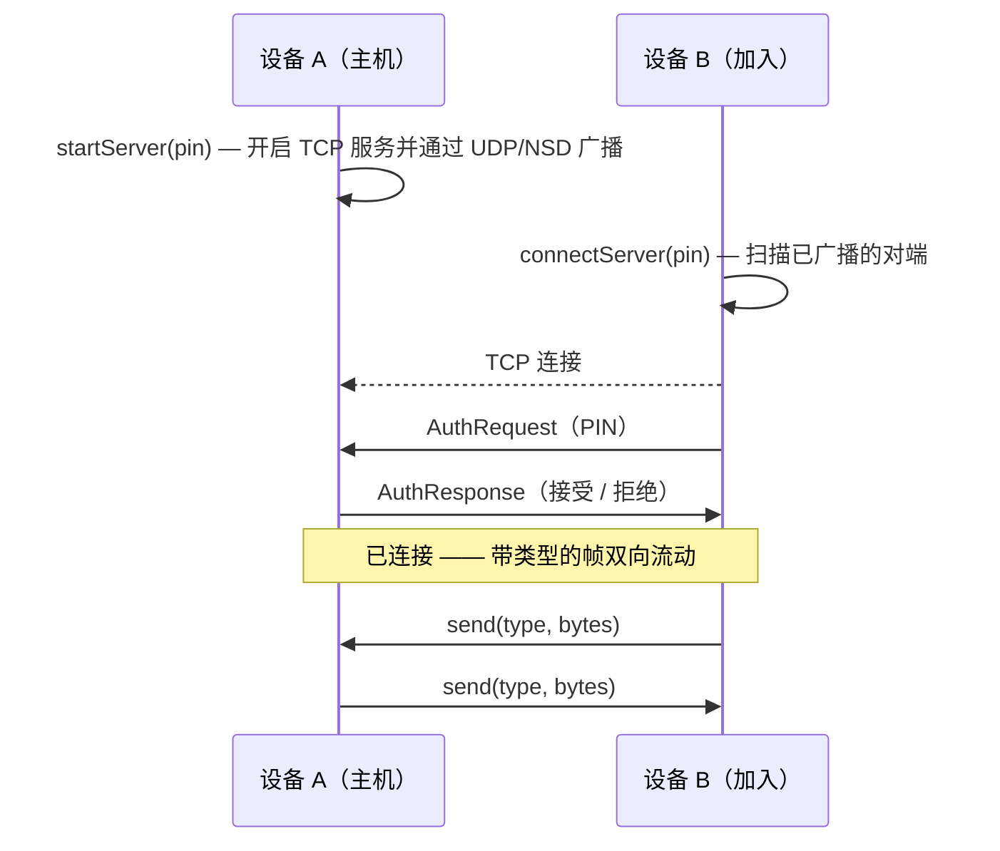

# LanLink

> 在局域网 Wi‑Fi 上点对点聊天——无需互联网、无需账号、无需服务器。两台设备用一个 6 位 PIN 配对即可通话。

<p align="left">
  
  
  
  
  
  
</p>

[English](README.md) | **简体中文**

LanLink 是一个轻量、依赖极少的 **[Kotlin Multiplatform](https://kotlinlang.org/docs/multiplatform.html) 库**，用于**局域网内设备到设备的通信**。它负责对端发现、连接、鉴权以及一条带类型标签的消息通道——让 App 无需互联网、账号或后端，就能在 Wi‑Fi 上构建点对点功能。设计上与平台无关，目前提供 Android target。

仓库内的可运行 `demo/` 模块（一个 PIN 配对的局域网聊天）完整演示了该库的用法。

---

## 亮点

- 🔢 **PIN 配对** —— 两台设备输入相同的 6 位 PIN 即可互相发现并连接，无需手动输入 IP。
- 📡 **零配置发现** —— UDP 广播 + Android NSD（mDNS）在同一 Wi‑Fi 下定位对端。
- 🔐 **可插拔鉴权** —— 开箱即用的共享密钥 `InMemoryAuthProvider`（带暴力破解锁定），也可自定义 `AuthProvider`。
- 🧩 **带类型的消息通道** —— 每个帧携带一个 `type` 标签 + 原始字节，可在一条连接上复用聊天、状态、文件等任意消息。
- 🌊 **协程与 Flow** —— 连接状态、入站消息、事件均以 `StateFlow`/`SharedFlow` 暴露。
- 🧱 **清晰的平台接缝** —— 所有传输都隐藏在 `LanNetworkFactory` 接口之后；新增一个平台只需写一个工厂，无需重写协议。
- ✅ **有测试** —— 覆盖发现、套接字、鉴权、连接服务的 30+ 单元测试，可在 JVM 上无设备运行。

---

## 工作原理

两台设备约定同一个 6 位 PIN，一方**作为主机（Host）**，另一方**加入（Join）**。发现、鉴权握手与消息通道全部由 `lanlink-core` 处理。



如果 PIN 不匹配，主机会拒绝握手并发出 `AuthFailed` 事件。失败次数过多时，鉴权提供者会锁定该调用方。

---

## 架构

```
┌─────────────────────────────────────────────────────────┐
│  demo  (com.ymr.lanlink)  — 示例 App，不属于库本身         │
│  MainActivity ─ LanViewModel ─ LanRepository ─ Service    │
└───────────────────────────┬─────────────────────────────┘
                            │ 依赖
┌───────────────────────────▼─────────────────────────────┐
│  lanlink-core  (com.ymr.lanlink.core)                     │
│                                                           │
│  commonMain                                               │
│    service/   PinConnectionService —— 编排逻辑            │
│    net/       LanNetworkFactory、LanServer/Client（接口）  │
│    data/      TcpSocket{Server,Client}、UdpDiscovery、auth │
│    domain/    ConnectionState、PeerInfo、AuthProvider …    │
│                                                           │
│  androidMain                                              │
│    AndroidLanNetworkFactory —— 接入 Ktor 套接字 + NSD     │
└───────────────────────────────────────────────────────────┘
```

核心设计是 **`LanNetworkFactory` 接缝**。`commonMain` 的编排逻辑只依赖接口（`LanServer`、`LanClient`、`DiscoveryAdvertiser`、`DiscoveryScanner`）。Android target 提供 `AndroidLanNetworkFactory`；未来的桌面/iOS target 只需写一个新工厂，协议与状态机原样复用。

### 技术栈

| 关注点 | 选型 |
|---|---|
| 语言 | Kotlin 2.3.20、Kotlin Multiplatform |
| 传输 | [Ktor](https://ktor.io/) `ktor-network` 3.5.0（TCP 套接字） |
| 线格式 | `kotlinx-serialization-protobuf` 1.11.0，长度前缀分帧 |
| 异步 | `kotlinx-coroutines` 1.10.2（`StateFlow` / `SharedFlow`） |
| 发现 | UDP 广播 + Android NSD（mDNS） |
| 构建 | Gradle 9.3.1、AGP 9.1.1、JVM 17、`minSdk 24` / `compileSdk 35` |

---

## 快速开始

### 前置条件

- JDK 17+
- Android SDK（API 35）
- 两台处于**同一 Wi‑Fi 网络**的设备（或模拟器）

### 试用 demo

```bash
git clone git@github.com:yangwuan55/LanLink.git
cd LanLink

# 构建并安装 demo 到已连接的设备
./gradlew :demo:installDebug
```

在两台设备上运行 demo，输入**相同的 6 位 PIN**，一台点 **Host**、另一台点 **Join** 即可。

---

## 将 `lanlink-core` 作为库使用

从 JitPack 引入：

```groovy
// settings.gradle —— repositories
maven { url 'https://jitpack.io' }

// app/build.gradle
implementation 'com.github.yangwuan55.LanLink:lanlink-core:0.1.0'
```

或作为本地模块：`include(":lanlink-core")` + `implementation project(':lanlink-core')`。

声明发现与套接字所需的权限：

```xml
<uses-permission android:name="android.permission.INTERNET" />
<uses-permission android:name="android.permission.ACCESS_WIFI_STATE" />
<uses-permission android:name="android.permission.ACCESS_NETWORK_STATE" />
```

### 接线

```kotlin
// AndroidLanNetworkFactory 提供基于 Ktor 的传输 + 发现实现。
val service: PinConnectionService = PinConnectionServiceImpl(AndroidLanNetworkFactory())

// 一端作为主机…
service.startServer(pin = "123456")

// …另一端加入。
service.connectServer(pin = "123456")
```

### 订阅状态、消息与事件

```kotlin
service.connectionState.collect { state ->
    when (state) {
        is PinConnectionState.Discovering -> showSearching()
        is PinConnectionState.Connected   -> showConnected(state.peerName)
        is PinConnectionState.Error        -> showError(state.reason)
        else -> Unit
    }
}

service.messageFlow.collect { frame: TypedMessage ->
    if (frame.type == TYPE_CHAT) {
        val text = frame.payload.decodeToString()
        // 渲染收到的消息
    }
}

service.eventFlow.collect { event ->
    if (event is PinConnectionEvent.AuthFailed) showAuthError(event.reason)
}
```

### 发送消息

```kotlin
const val TYPE_CHAT = 0

// `type` 会随帧传到对端，接收方据此决定如何解析字节——
// 用不同的 type 值即可复用多种消息类型。
service.send(type = TYPE_CHAT, data = "Hello!".encodeToByteArray())
```

### `PinConnectionService` 一览

| 成员 | 作用 |
|---|---|
| `connectionState: StateFlow<PinConnectionState>` | Idle → Discovering → Connecting → Connected / Error |
| `messageFlow: SharedFlow<TypedMessage>` | 入站帧（`type` 标签 + 原始 `payload` 字节） |
| `eventFlow: SharedFlow<PinConnectionEvent>` | 对端连接/断开、鉴权失败 |
| `startServer(pin)` | 主机：开启 TCP 服务并广播 |
| `connectServer(pin)` | 加入：发现并连接到主机 |
| `send(type, data)` | 向对端发送一个带类型的帧 |
| `disconnect()` | 关闭会话 |

### 自定义鉴权

```kotlin
class TokenAuthProvider(private val token: ByteArray) : AuthProvider {
    override suspend fun authenticate(peerName: String, credentials: ByteArray?): AuthResult =
        if (credentials.contentEquals(token)) AuthResult.Success(peerName)
        else AuthResult.Failure("invalid token")

    override fun getCredentials(): ByteArray = token
}
```

通过自定义的 `LanNetworkFactory` 传入你的鉴权提供者（接线方式参见 `AndroidLanNetworkFactory`）。内置的 `InMemoryAuthProvider` 校验 6 位 PIN，并在多次失败后锁定；`NoOpAuthProvider` 接受所有连接（仅供测试）。

---

## 线协议

帧是**长度前缀的 protobuf** 消息。传输层承载一个 `TypedMessage(type, payload)`：一个整数 `type` 标签加上一段不透明的字节负载。核心库从不解析负载——每种 `type` 的编码由你的 App 自己决定，因此聊天、状态、文件传输可共用同一条连接。

---

## 项目结构

```
LanLink/
├── lanlink-core/            # 核心 Kotlin Multiplatform 库
│   └── src/
│       ├── commonMain/      # 协议、服务、接口、模型
│       ├── commonTest/      # 可在 JVM 运行的单元测试
│       └── androidMain/     # Android 工厂、NSD、平台 actual 实现
├── demo/                    # 使用该库的演示 Android App（MVVM）
├── tests/                   # Robot Framework 双设备 E2E 测试
└── settings.gradle
```

---

## 测试

```bash
# 核心单元测试（在 JVM 运行，无需设备）
./gradlew :lanlink-core:testAndroidHostTest

# demo 单元测试
./gradlew :demo:testDebugUnitTest

# Android 仪器化测试（需要设备/模拟器）
./gradlew :demo:connectedDebugAndroidTest
```

双设备端到端场景（PIN 配对、收发消息、错误 PIN 拒绝）位于 `tests/dual_device_test.robot`，适用于 Robot Framework + Appium 环境。

---

## 路线图

- [ ] 通过新的 `LanNetworkFactory` 实现，新增更多 Kotlin Multiplatform target（桌面/JVM、iOS）
- [ ] TLS / 加密传输
- [ ] 在类型化通道之上提供文件与二进制负载的辅助工具
- [x] 已发布到 JitPack（[`0.1.0`](https://jitpack.io/#yangwuan55/LanLink)）

---

## 安全

> ⚠️ 默认的 PIN 握手**未加密**。凭据与消息在局域网中以明文传输。

LanLink 面向受信任的局域网与演示场景。在流量可能被监听的环境中使用前，请加入 TLS / 加密传输，并考虑基于证书的鉴权。`AuthProvider` 接缝正是为更强方案预留的扩展点。

---

## 贡献

欢迎提交 Issue 与 Pull Request，请注意：

1. 改动保持聚焦并有测试覆盖（`:lanlink-core:testAndroidHostTest` 应保持绿色）。
2. 遵循现有的模块边界——协议逻辑放在 `commonMain`，平台接线放在 `androidMain`。
3. 提 PR 前先跑一遍构建：`./gradlew :demo:assembleDebug :lanlink-core:testAndroidHostTest`。

---

## 许可证

基于 **Apache License 2.0** 发布。
